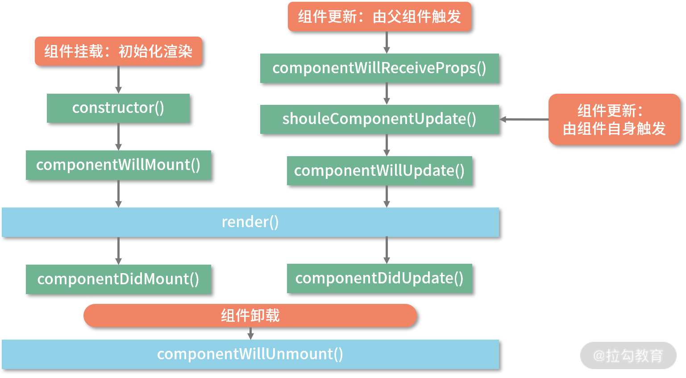

## jsx本质是什么
jsx是JavaScript的扩展，他会编译为react.createElement()，并将返回一个叫做react element的JS对象

## 虚拟DOM是什么
虚拟DOM本质是以JavaScript对象形式存在的对DOM的描述

虚拟DOM的好处：性能(diff算法)、跨平台

## 生命周期

### react15的生命周期



如果父组件导致组件重新渲染，即使props没有更改，也会调用componentReceiveProps方法。即**componentReceiveProps 并不是由 props 的变化触发的，而是由父组件的更新触发的**

### react16的生命周期


getDerivedStateFromProps 在此方法里是访问不到this的因为他是个静态的方法，两个参数props和state，分别代表当前组件接收到来自父组件的props和当前组件自身的state，且需要一个对象的返回值来更新组件的state

getSnapshotBeforeUpdate的返回值作为第三个参数给到componentDidUpdate，它的执行时机是render方法之后，真实DOM更新之前，此时，我们可以同时获取到更新前的真实DOM和更新前后的state / props信息

### Fiber架构
react渲染由原来的同步渲染变为可以被打断的异步渲染，即render阶段是允许暂停、终止和重启的，就会导致render阶段的生命周期都是有可能被重复执行的：componentWillMount、componentWillUpdate、componentWillReceiveProps

### Redux
store：单一的数据源，且是只读的

action：对变化的描述

reducer：对变化进行分发和处理，将新的数据返回给store

### 类组件与函数组件
类组件需要继承class，可以访问生命周期方法，可以获取到实例化的this，并基于这个this做各种各样的事情，可以定义并维护state(状态)。类组件是面向对象编程思想的一个表征，即封装和继承

函数组件会捕获render内部的状态，这是两类组件最大的不同。

函数组件的好处：this绑定的问题，逻辑与生命周期耦合在一起

### hooks原则

+ 只在react函数中调用hook

+ 不要在循环、条件或嵌套函数中调用hook，即确保hooks在每次渲染时都保持同样的执行顺序(本质是链表)

### setState同步异步？

### react事件系统
w3c标准约定了一个事件的传播过程：事件捕获阶段、目标阶段、事件冒泡阶段

当事件在具体的 DOM 节点上被触发后，最终都会冒泡到 document 上，document 上所绑定的统一事件处理程序会将事件分发到具体的组件实例。

**DOM事件流下的性能优化思路---事件委托**

### react路由

**路由器负责感知路由的变化并作出反应**

分为hash路由(通关url的hash属性来控制路由的)和browser路由(使用html5的historyAPI来控制路由的)

前端路由需要

+ 拦截用户的刷新操作，避免服务端盲目响应、返回不符合预期的资源内容

+ 感知url的变化

### react性能优化(重要)

**使用 shouldComponentUpdate 规避冗余的更新逻辑**

+ 只要父组件发生了更新，那么所有的子组件都会被无条件更新

+ 当组件自身调用了 setState 后，那么不管 setState 前后的状态内容是否真正发生了变化，它都会去走一遍更新流程

+ react根据shouldComponentUpdate的返回值true/false来决定是否更新

**PureComponent + Immutable.js**

PureComponent内置了对shouldComponentUpdate的实现，对组件更新前后的props和state进行浅比较，故数据类型为引用类型不适合

**React.memo 与 useMemo**

react.memo 函数版的shouldComponentUpdate：

```js

import React from "react";
// 将 ChildB 改写为 function 组件
function ChildB(props) {
  console.log("ChildB 的render 逻辑执行了");
  return (
    <div className="childB">
      子组件B的内容：
      {props.text}
    </div>
  );
}
// areEqual 用于对比 props 的变化
function areEqual(prevProps, nextProps) {
  if(prevProps.text === nextProps.text) {
    return true
  }
  return false
}
// 使用 React.memo 来包装 ChildB
export default React.memo(ChildB, areEqual);

```

useMemo控制是否需要重复执行某一段逻辑：

```js

// 我们可以把目标逻辑作为第一个参数传入，把逻辑的依赖项数组作为第二个参数传入。这样只有当依赖项数组中的某个依赖发生变化时，useMemo 才会重新执行第一个入参中的目标逻辑

const memoizedValue = useMemo(() => computeExpensiveValue(a, b), [a, b]);

```


