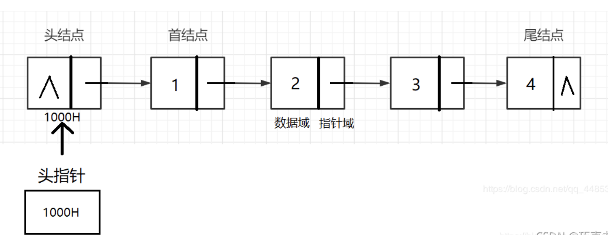

数据表、单链表(\*)相关运算以及分析
一、线性表
概念：a1、a2、a3...an 有限序列
运算：置空、求表长、取第 i 个元素、按值查找、插入、删除

二、顺序表
插入删除操作需要大量移动元素
平均移动 n/2 O(n) 元素移动 n-i+1 次
平均移动(n-1)/2 O(n)

三、链表
首节点 尾节点 头节点 头指针 尾指针

采用头插法建立单链表 s->next = l->next , l->next = s
采用尾插法建立单链表 r->next = s , r = s (r 指向新的表尾节点)

双链表
插入：
删除：

循环单链表：
循环双链表：

四、栈
五、队列
六、多维数组
七、矩阵
八、广义表

二叉树(\*)相关运算
九、树
十、图
十一、排序
